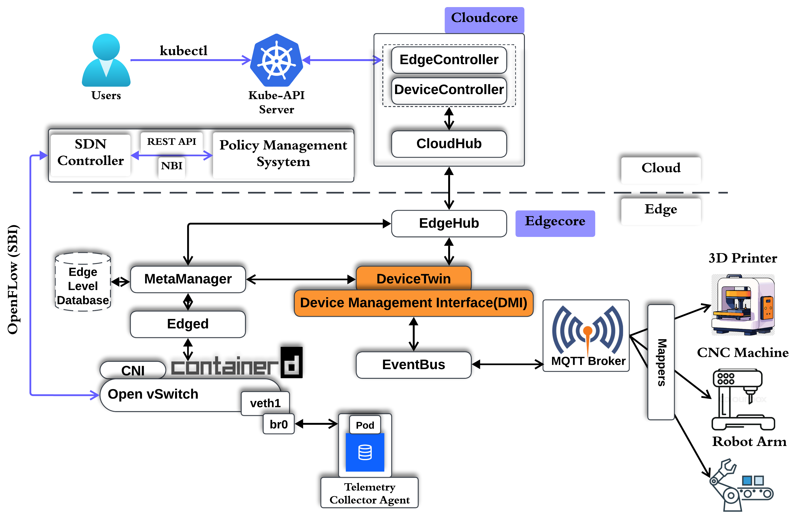

# SDN-Integrated Cloud–Edge Digital Twin Framework for Real-Time Monitoring in Additive Manufacturing (AM)

This repository provides a reference implementation of an **SDN-integrated cloud–edge Digital Twin (DT) framework** for **real-time monitoring** and **programmable traffic control** in **additive manufacturing (AM)** environments.

It combines:

* **KubeEdge DeviceTwin** for edge-local Digital Twin state caching + cloud synchronization
* **MQTT → TelemetryAgent → Kafka (Strimzi)** for real-time telemetry streaming
* **Policy Management System (PMS)** for anomaly/policy decisions in the cloud
* **ONOS SDN controller + Open vSwitch (OVS)** for flow-level enforcement at the edge
* **Prometheus + Grafana** for collecting and visualizing metrics

The framework targets IoT-enabled AM assets such as **3D printers, CNC machines, and robotic arms**, enabling **low-latency twin synchronization**, **adaptive policy enforcement**, and **resilient operation under unstable edge–cloud connectivity**.

---



---

## 🚀 Architecture Overview

### Nodes (Kubernetes + KubeEdge)

| Role   | Node         | Runtime              | Networking                       | What it hosts                                                                                         |
| ------ | ------------ | -------------------- | -------------------------------- | ----------------------------------------------------------------------------------------------------- |
| Master | `MasterNode` | containerd           | Flannel (pod network)            | Kubernetes control plane                                                                              |
| Cloud  | `CloudNode`  | containerd           | Flannel                          | CloudCore (pod), ONOS (pod), Kafka/Strimzi (pods), PMS (pod), Monitoring stack (pods)                 |
| Edge   | `EdgeNode`   | containerd + systemd | OVS-based custom edge networking | EdgeCore (systemd), MQTT broker, TelemetryAgent (pod attached to OVS), AM device simulators (systemd) |

---

## 🧩 Planes & Key Components

### 🟩 Digital Twin & Edge Orchestration Plane (KubeEdge)

| Component    | Description                                                                                                    |
| ------------ | -------------------------------------------------------------------------------------------------------------- |
| `CloudCore`  | Cloud-side coordination (CloudHub, EdgeController, DeviceController) and CRD-based visibility of device states |
| `EdgeCore`   | Edge runtime (Edged, EdgeHub, MetaManager, **DeviceTwin**) with local caching + intermittent-link resilience   |
| `DeviceTwin` | Maintains synchronized virtual replicas; edge-local persistence with buffering under link failures             |

### 🟧 Telemetry & Streaming Plane

| Component                | Description                                                                                |
| ------------------------ | ------------------------------------------------------------------------------------------ |
| `Mosquitto MQTT Broker`  | Edge-local broker for AM device telemetry publishing                                       |
| `TelemetryAgent`         | Subscribes to MQTT, structures metrics, exports Prometheus metrics, and publishes to Kafka |
| `Apache Kafka (Strimzi)` | Event-streaming backbone for scalable telemetry transport to cloud analytics/enforcement   |

### 🟦 Policy & SDN Control Plane

| Component                        | Description                                                                     |
| -------------------------------- | ------------------------------------------------------------------------------- |
| `Policy Management System (PMS)` | Consumes Kafka topics, detects anomalies/violations, decides mitigation actions |
| `ONOS SDN Controller`            | Receives PMS intents (REST) and programs OVS via OpenFlow                       |
| `Open vSwitch (OVS)`             | Enforces isolation/rerouting/throttling policies on edge traffic                |

### 🔵 Data Plane (AM Devices)

| Component              | Description                                                                                    |
| ---------------------- | ---------------------------------------------------------------------------------------------- |
| `AM device simulators` | Virtualized 3D printer, CNC machine, robot arm (systemd services) publishing telemetry to MQTT |
| `Edge networking`      | OVS bridge (`br0`) providing programmable switching under ONOS control                         |

---

## 📦 Directory Structure

```bash
.
├── deployments/
│   ├── cloud/
│   │   ├── cloudcore.yaml
│   │   ├── kafka-strimzi.yaml
│   │   ├── pms-deployment.yaml
│   │   ├── onos-deployment.yaml
│   │   └── grafana-prometheus.yaml
│   └── edge/
│       ├── mqtt-mosquitto.yaml
│       ├── telemetry-agent.yaml
│       └── ovs-attach/
│           ├── attach-pod-to-ovs.sh
│           └── README.md
├── edgecore/
│   ├── config/
│   └── systemd/
│       └── edgecore.service
├── devices/
│   ├── 3d-printer/
│   ├── cnc-machine/
│   └── robot-arm/
├── telemetry-agent/
│   ├── Dockerfile
│   ├── requirements.txt
│   └── telemetry_agent.py
├── pms/
│   ├── Dockerfile
│   ├── requirements.txt
│   └── pms_service.py
├── figs/
│   ├── camad2025_architecture.png
│   ├── devicetwin_subsystem.png
│   └── sdn_control_loop.png
└── README.md
```

---

## 🔧 Setup Guide (Complete, Copy-Paste Friendly)

### 0) Prerequisites

**Cluster**

* 3 nodes: `MasterNode`, `CloudNode`, `EdgeNode`
* Kubernetes installed with `containerd`
* **Flannel** CNI (Master + Cloud nodes)

**KubeEdge**

* CloudCore deployed on **CloudNode** (as a Kubernetes pod)
* EdgeCore deployed on **EdgeNode** (as a **systemd** service)

**Networking**

* ONOS reachable from EdgeNode (OpenFlow port `6653`)
* EdgeNode uses **OVS** bridge `br0` for programmable data plane

---

### 1) Deploy Cloud Components (CloudNode)

> Run these from a machine that has `kubectl` access to the cluster.

#### 1.1 Deploy Kafka using Strimzi

```bash
kubectl apply -f deployments/cloud/kafka-strimzi.yaml
```

#### 1.2 Deploy ONOS SDN Controller

```bash
kubectl apply -f deployments/cloud/onos-deployment.yaml
```

Verify ONOS is running:

```bash
kubectl get pods -A | grep onos
```

#### 1.3 Deploy Policy Management System (PMS)

```bash
kubectl apply -f deployments/cloud/pms-deployment.yaml
```

#### 1.4 Deploy Prometheus + Grafana (optional but recommended)

```bash
kubectl apply -f deployments/cloud/grafana-prometheus.yaml
```

---

### 2) Set Up Edge Node (EdgeNode)

#### 2.1 Install and configure Open vSwitch (OVS)

```bash
sudo apt-get update
sudo apt-get install -y openvswitch-switch

sudo ovs-vsctl add-br br0
sudo ovs-vsctl set-fail-mode br0 secure
```

Point OVS to ONOS controller (replace placeholders):

```bash
sudo ovs-vsctl set-controller br0 tcp://<ONOS_IP_OR_SERVICE_IP>:6653
sudo ovs-vsctl set bridge br0 protocols=OpenFlow13
```

Check controller connection:

```bash
sudo ovs-vsctl show
```

---

### 3) Deploy MQTT Broker (EdgeNode)

Deploy Mosquitto (pod or daemon). If you use the provided manifest:

```bash
kubectl apply -f deployments/edge/mqtt-mosquitto.yaml
```

Confirm it is reachable (example assumes a `mosquitto` service exists):

```bash
kubectl get svc -A | grep mosquitto
```

---

### 4) Run KubeEdge EdgeCore as a systemd service (EdgeNode)

Enable/start EdgeCore:

```bash
sudo systemctl enable edgecore
sudo systemctl start edgecore
sudo systemctl status edgecore --no-pager
```

If you keep a custom unit file in this repo:

```bash
sudo cp edgecore/systemd/edgecore.service /etc/systemd/system/edgecore.service
sudo systemctl daemon-reload
sudo systemctl restart edgecore
```

---

### 5) Build, Push, and Deploy TelemetryAgent

#### 5.1 Build & push

```bash
docker build -t <your-registry>/telemetry-agent:latest telemetry-agent/
docker push <your-registry>/telemetry-agent:latest
```

#### 5.2 Deploy to Kubernetes

```bash
kubectl apply -f deployments/edge/telemetry-agent.yaml
```

Verify:

```bash
kubectl get pods -A | grep telemetry
```

---

### 6) Attach TelemetryAgent Pod to OVS (EdgeNode)

Because OVS is the edge data plane switch, you may attach the TelemetryAgent pod to `br0` using a **veth pair**.

Example workflow (adapt to your environment):

```bash
cd deployments/edge/ovs-attach
chmod +x attach-pod-to-ovs.sh

# Example:
# ./attach-pod-to-ovs.sh <namespace> <pod-name> br0
./attach-pod-to-ovs.sh default telemetry-agent-pod br0
```

> Keep the detailed logic and required privileges documented in `deployments/edge/ovs-attach/README.md`.

---

### 7) Start AM Device Simulators (EdgeNode)

Run your AM device publishers as systemd services that publish to MQTT topics, e.g.:

* `/am/3d_printer`
* `/am/cnc_machine`
* `/am/robot_arm`

Example pattern:

```bash
sudo systemctl enable am-3d-printer
sudo systemctl start am-3d-printer

sudo systemctl enable am-cnc
sudo systemctl start am-cnc

sudo systemctl enable am-robot-arm
sudo systemctl start am-robot-arm
```

---

### 8) End-to-End Sanity Checks

#### 8.1 MQTT ingestion

From EdgeNode:

```bash
mosquitto_sub -h <MQTT_BROKER_IP> -t "/am/#" -v
```

#### 8.2 Kafka topics (CloudNode)

```bash
kubectl get pods -A | grep kafka
# then exec into a kafka tools pod / client pod if you have one
```

#### 8.3 ONOS + OVS connectivity

On EdgeNode:

```bash
sudo ovs-vsctl show
sudo ovs-ofctl -O OpenFlow13 dump-flows br0
```

---

## 🔁 Control Loops Implemented

### A) DeviceTwin Synchronization Loop

1. AM device publishes telemetry to MQTT
2. EdgeCore DeviceTwin updates local twin state
3. Syncs to CloudCore (and buffers locally under intermittent links)

### B) Event Streaming + SDN Enforcement Loop

1. TelemetryAgent consumes MQTT and publishes structured telemetry to Kafka
2. PMS consumes Kafka, detects anomaly/policy violation
3. PMS issues REST enforcement intent to ONOS
4. ONOS programs OVS flows (block/reroute/throttle) via OpenFlow

---

## 📈 Monitoring & Visualization

### Prometheus Metrics (examples)

Expose metrics from:

* `telemetry-agent` (MQTT receive rate, processing latency, Kafka publish latency)
* `pms` (alerts processed, actions triggered, decision latency)
* `onos` (controller health, flow install stats)

### Grafana Dashboards (examples)

* Digital Twin sync latency over time
* MQTT → Kafka pipeline latency breakdown
* Enforcement actions per anomaly type
* Flow rule changes vs telemetry spikes

---

## 📚 Publication

This repository implements the architecture described in:

**“SDN-Integrated Cloud-Edge Digital Twin Framework for Real-Time Monitoring in Additive Manufacturing”**
(Recently published work)

---

## ✨ Highlights

* Edge-local **Digital Twin caching + resilient synchronization** using KubeEdge DeviceTwin
* Real-time telemetry streaming over **MQTT + Kafka (Strimzi)**
* Closed-loop **policy-driven SDN enforcement** through **PMS → ONOS → OVS**
* Designed for AM device ecosystems (3D printers, CNC, robot arms) with intermittent cloud connectivity

---

## 🧾 License & Citation

If you use this codebase or architecture in academic work, please cite the publication above.